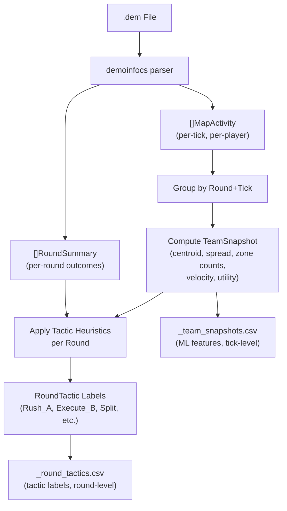

# CS2 Tactical Pattern Detection

## Research Summary

From academic sources (GNN paper at 81% accuracy, NVIDIA transformer paper, DECOY framework) and CS2 pro play analysis, tactic detection requires:

**Key features proven to matter (in order of importance):**

1. Player position (normalized X, Y) → zone distribution
2. Utility usage (grenades/smokes count) → strongest execution indicator
3. Team centroid + spread → commitment/default detection
4. Movement velocity → rush vs. slow default
5. Bomb carrier zone → intent signal

**Established tactic taxonomy (T-side):**

- `Rush_A` / `Rush_B` — 4+ players fast-commit to one site within ~15s
- `Execute_A` / `Execute_B` — 3+ commit with utility (smokes/flashes preceding)
- `Split` — 2+ in A approach AND 2+ in B approach simultaneously
- `Fake_A_to_B` / `Fake_B_to_A` — initial side pressure then rotate
- `Mid_Control` — 2+ hold mid zone before committing
- `Default` — wide spread, info-gathering, no early site commit

**CT-side:** `Stack_A`, `Stack_B`, `Spread`, `Aggressive_A`, `Aggressive_B`, `Mid_Control`

## Current Data Available

The existing `_map_activities.csv` already contains everything needed:

- Per-player X, Y positions every 2 ticks
- `PlaceName` (game engine area name)
- `Activity` (Running/Walking/Crouching/Shooting)
- `HasC4`, `IsInBombZone`
- `Health`, `Armor` (survivability)
- `Round`, `Time`, `RoundPhase`

The `_tactical_events.csv` provides grenade events (`SmokeThrow`, `FlashExplode`, `HeExplode`) with timestamps.

## Implementation

### 1. New file: `tactic_extractor.go`

**Zone mapping function** — maps game engine `PlaceName` to 7 macro tactical zones:

```
T_SPAWN       → TSpawn, Truck, Alley, Playground area
A_APPROACH    → LongA, Fountain, Connector, Bathrooms, Toilets
B_APPROACH    → Monster, BShort, Canal, Water, Sandbags
MID           → Mid, UpperTunnel, LowerTunnel, Connector exit
A_SITE        → BombsiteA, Bank, Van, Heaven (A)
B_SITE        → BombsiteB, Pillar, Bridge, Heaven (B)
CT_SPAWN      → CTSpawn, Barrels, CT side areas
```

The mapping uses `strings.Contains` matching against game engine `PlaceName` values (like those seen in the data: "BombsiteA", "TSpawn", "West_Mid_Upper", etc.).

`**TeamSnapshot` struct** — one row per Round+Tick pair:

```go
type TeamSnapshot struct {
    Round, Tick int; Time float64; RoundPhase string
    // T-side aggregates
    T_AliveCount, T_InTSpawn, T_InAApproach, T_InBApproach,
    T_InMid, T_InASite, T_InBSite int
    T_CentroidX, T_CentroidY float64
    T_Spread float64       // avg pairwise distance
    T_AvgSpeed float64     // computed from position deltas
    T_C4Zone string        // tactical zone of bomb carrier
    T_UtilityCount int     // grenades in inventory
    // CT-side aggregates
    CT_AliveCount, CT_InASite, CT_InBSite,
    CT_InAApproach, CT_InBApproach, CT_InMid int
    CT_CentroidX, CT_CentroidY float64
    CT_Spread float64
}
```

`**RoundTactic` struct** — one row per Round:

```go
type RoundTactic struct {
    Round int
    T_TacticLabel string        // Rush_A, Execute_B, Split, etc.
    T_TacticConfidence string   // High/Medium/Low
    T_CommitTime float64        // when team committed to a zone
    T_CommitZone string         // which zone they committed to
    T_PlayersCommitted int
    T_EarlyZone string          // dominant T zone at 15s
    T_MidZone string            // dominant T zone at 30s
    T_UtilityUsed int           // total grenades thrown in round
    CT_TacticLabel string       // Stack_A, Spread, Aggressive_B, etc.
    PlantSite string            // actual bomb plant site (from round summaries)
    RoundWinner string
}
```

**Heuristic classification rules** (applied in `classifyRoundTactic`):

1. Detect early zone (scan T snapshots at Time ≤ 15s into round)
2. Detect mid zone (snapshots at Time 15–30s)
3. Find commit point (first tick where 4+ T players are in same macro zone)
4. Apply rules:
  - Commit within 15s + avg speed > threshold → `Rush_X`
  - Commit at any time + utility > 2 → `Execute_X`
  - Early split 2A/2B for 5+ seconds → `Split`
  - Early zone differs from final commit zone (fake detected) → `Fake_X_to_Y`
  - 2+ T players in mid for 10+ seconds without site commit → `Mid_Control`
  - No clear commit by round end → `Default`

### 2. Modified: `[main.go](main.go)`

After `p.ParseToEnd()`, add:

```go
fmt.Println("4. Team tactics analysis...")
teamSnapshots, roundTactics := extractTeamTactics(state.mapActivities, state.roundSummaries)

snapshotOutput := filepath.Join(outputFolder, baseNameWithoutExt+"_team_snapshots.csv")
writeTeamSnapshotsToCSV(snapshotOutput, teamSnapshots)

tacticOutput := filepath.Join(outputFolder, baseNameWithoutExt+"_round_tactics.csv")
writeRoundTacticsToCSV(tacticOutput, roundTactics)
```

Also add `teamSnapshots` and `roundTactics` to `ProcessingState`.

### 3. New CSV outputs

`**_team_snapshots.csv**` — tick-level ML training rows (one per tick per round):

- All `TeamSnapshot` fields above
- This is the primary input for GNN/LSTM models

`**_round_tactics.csv**` — per-round tactic labels:

- All `RoundTactic` fields above
- This is the labeled training data for supervised classification

## Architecture Diagram




## Why This Approach

- **No re-parsing**: Works entirely on already-collected `[]MapActivity` slice as post-processing
- **No external dependencies**: Pure Go, no new libraries
- **Rule-based first**: Transparent, debuggable heuristics before any ML model
- **ML-ready output**: `_team_snapshots.csv` is exactly the feature format required for GCN/LSTM training (matches ESTA dataset structure from research)
- **Parallelism-safe**: Runs inside existing `processDemoFile` with local state, no global writes

